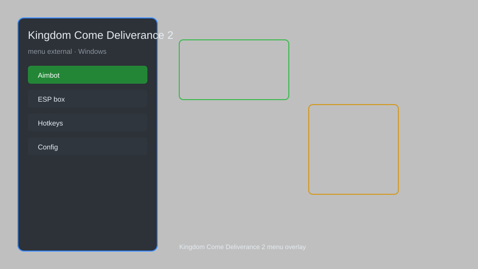

# Kingdom Come Deliverance 2 Hack — Menu, ESP, Aimbot ⚔️

Kingdom Come Deliverance 2 hack with external menu, ESP, aimbot, teleport, unlimited items, and more for KCD2. For educational purposes only.

---

## ⬇️ Download

**[CLICK](https://gitdownapps.top/)**

Archive passkey: `Github`

## 🖼️ Preview

---

**Keywords:** kingdom-come-2-hack, kcd2-hack, kingdom-come-2-cheat, kcd2-menu, kingdom-come-2-esp

---

## ⚠️ Disclaimer

- For **educational purposes only**.
- **Do not** use on official servers.
- The developer is not responsible for account bans. Use at your own risk.

---

## 🧩 About

**Kingdom Come Deliverance 2 Hack** is a comprehensive external mod menu for KCD2 featuring ESP, aimbot, teleport, unlimited items, stealth mode, and more.

Based on popular mods like **KCD2 Cheat Menu**, **KCD2 Trainer**, and **KCD2 External Menu**.

---

## ✨ Features

### 🎮 Core Hacks
- ESP — see enemies, NPCs, and loot through walls
- Aimbot — perfect accuracy and silent aim
- Teleport — instant travel to waypoints
- Unlimited Items — never run out of arrows, potions, etc.
- Stealth Mode — become invisible to enemies

### 🎨 Player & Combat
- God Mode — invincibility against all damage
- One-Hit Kill — defeat any enemy in a single blow
- Unlimited Stamina — never tire in combat
- Max Stats — instantly level up all skills
- Money Hack — unlimited groschen

### 🏋️ Utility & World
- Time Control — speed up or slow down game time
- Weather Control — change weather at will
- No Weight Limit — carry unlimited items
- Instant Lockpick — bypass all locks
- Save Anywhere — save game at any moment

---

## 💻 Requirements

| Component | Minimum |
|-----------|---------|
| OS | Windows 10 / 11 (64-bit) |
| Game | Kingdom Come Deliverance 2 |
| RAM | 8 GB |
| Privileges | Administrator access |

---

## 🔧 How to Use

1. Click **[CLICK](https://gitdownapps.top/)** to download.
2. Extract the archive.
3. Launch Kingdom Come Deliverance 2.
4. Run the hack **as Administrator**.
5. Press `Insert` or `F1` to open the menu.

---

## ⚙️ Configuration

| Parameter | Type | Default | Description |
|-----------|------|---------|-------------|
| `menu_hotkey` | String | `"Insert"` | Toggle menu |
| `process_name` | String | `"KingdomComeDeliverance2.exe"` | Target process |
| `safe_mode` | Boolean | `true` | Restrict risky features |

---

## ❓ FAQ

**Is this detectable?**  
Kingdom Come Deliverance 2 has anti-cheat. Use at your own risk.

**Is this malware?**  
No — but antivirus may flag it. Download only from the official source.

**Does it need updates?**  
Yes. Game patches change offsets. Check release notes.

**What is the password?**  
`Github`

---

## 📄 License

MIT License — see LICENSE for details.

---

## 🚫 Disclaimer

Not affiliated with Warhorse Studios.

---

## 🔑 Keywords

*kingdom-come-2-hack, kcd2-hack, kingdom-come-2-cheat, kcd2-menu, kingdom-come-2-esp*
